# iT ASSET MANAGEMENT

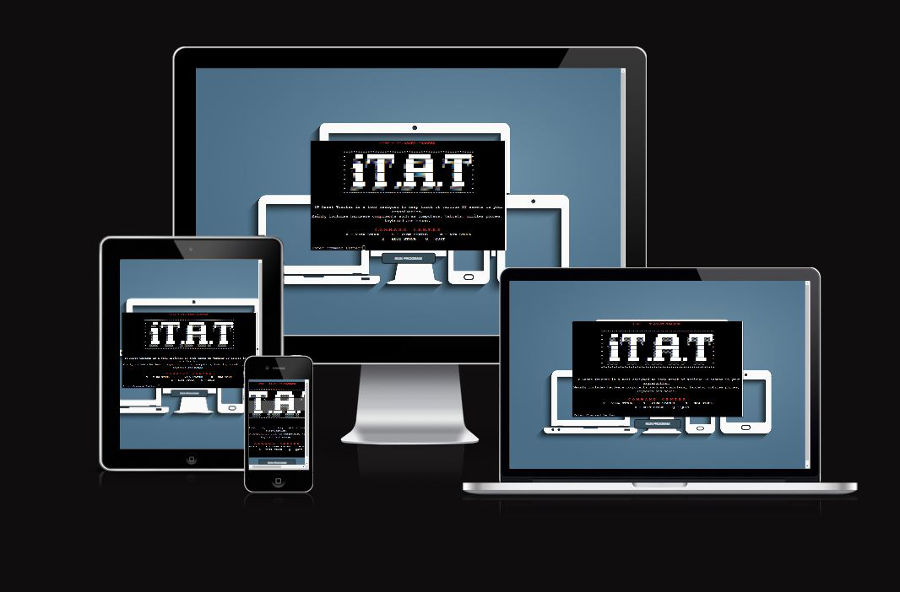

# Table of Contents
- [Project Introduction](#project-introduction)
    - [iT Asset Tracker](#it-asset-tracker)
    - [Link to live project](#link-to-live-project)
    - [Objective](#objective)
-   [User Experience](#user-experience)
    - [User Stories](#user-stories)
    - [Strategy Plan](#strategy-plan)
    - [Scope](#scope)
-   [Design](#design)
    - [Wireframe](#wireframe)
    - [Colour Scheme](#colour-scheme)
    - [Images](#images)
    - [Flowchart](#flowchart)
-   [Features](#features)
    - [Welcome Screen](#Welcome-Screen)
    - [Command Center](#command-center)
    - [V - View Stock](#v---view-stock)
    - [S - View Status](#s---view-status)
    - [N - New Stock](#n---new-stock)
    - [E - Edit Stock](#e---edit-stock)
    - [Q - Quit](#q---quit)
    - [Storage Data](#storage-data)
    - [Date validations](#date-validations)
-   [Future Features](#future-features)
-   [Testing](#testing)
-   [Bugs and Potential Issue](#bugs-and-potential-issu)
-   [Technologies And Languages](#technologies-and-languages)
    - [Languages Used](#languages-used)
    - [Python Modules](#python-modules)
    - [User Defined Modules](#user-defined-modules)
    - [Programs and frameworks](#programs-and-frameworks)
    - [Development](#development)
    - [Deployment on Heroku](#deployment-on-heroku)
    - [Forking your repository](#forking-your-repository)
    - [Cloning Repository](#cloning-repository)
- [Credits](#credits)
- [Acknowledgements](#acknowledgements)

## Project Introduction

### IT Asset Tracker

This program is designed to track IT assets, allowing IT administrators to add, view, assign and unassign stock to staff.

### [Link to live project](https://itat-itassettracker-400e99525065.herokuapp.com/) 
To open this link to new window, please right click and open link in new window.

### Objective
To create an application that will assist IT Administrator in managing their IT assets. This application was designed using Python with Google Sheet API integration. The objective is to provide various functionalities such as adding new stock types, viewing current stock status, viewing assigned stock status, editing stock (assigning or unassigning), and quitting the application.

## User Experience
To efficiently manage and track IT assets within an organization. This includes the following tasks:

 - Viewing Stock Status: Users should be able to view status of each item including details such as who it is assigned to.

 - Viewing Current Stock: Users should be able to view the current inventory of IT assets, including details such as the SKU, type, quantity, and availability.

  - Adding New Stock: Users should be able to easily add new IT assets to the inventory, specifying details such as the check-in date, type of asset, and quantity.

 - Assigning Stock: Users should be able to assign IT assets to staff members, recording details such as the date of assignment, the staff member's name, and the stock ID.

 - Unassigning Stock: Users should be able to unassign IT assets from staff members when necessary, updating the status of the assets in the inventory.

 - Viewing Status: Users should be able to view the status of assigned IT assets, including details such as the check-out date, staff member assigned, and current status.

 - Managing Stock Types: Users may need to manage the list of available stock types, including adding new types, updating existing types, or removing obsolete types.

### User Stories
As an IT administrator, I would like to do the following: 
 - I want to add new IT assets to the inventory, specifying details such as the check-in date, type of asset, and quantity, so that the inventory is up-to-date.

 - As an IT administrator, I want to assign IT assets to staff members, recording details such as the date of assignment, the staff member's name, and the stock ID, so that assets are properly allocated and tracked.

 - I want to unassign IT assets from staff members when necessary, updating the status of the assets in the inventory, so that assets can be reallocated or returned as needed.

 - I want to edit or modify existing stock entries, such as updating quantities or correcting details, to keep the inventory accurate and up-to-date.

 - I want to manage the list of available stock types, including adding new types, updating existing types, or removing obsolete types, to ensure that the inventory reflects the current range of assets.

 - I want reporting capabilities to generate reports on stock levels, stock assignments, usage trends, and other relevant metrics, to provide insights into asset management and usage within the organization.

### Strategy Plan
Creating this application involves several steps. I want to ensure that it will meet the needs and provides a solution for managing IT assets effectively. Here's my plan on the creation of this application.
 - DESIGN: I first design my application. I used [Lucidchart](https://lucid.app/) to create my flowchart. this helped me visualized the flow of the functionality of my application that I want to achieve.
 - DATA SHEET: I created a [Google Sheet](https://docs.google.com/) where I want to store inputs on my application. I make sure that this is properly integrated to my Github account.
 - CODING: I used [Gitpod](https://gitpod.io) to create this application. I also referenced some of my work from the Love Sandwiches video tutorial. Basic steps such as setting up my [Heroku](https://heroku.com) and Google Sheets can be found on the Love Sandwiches video tutorial.
 - STYLE: When I was 75% complete, I added the style to make this project look appealing to end users.
 - DEPLOYMENT: I set up my Heroku account half way through my project and the deployment instruction can also be found in the Love Sandwiches video tutorial.
 - TEST AND DEBUG: While creating this project, I encountered some bugs which is detailed on the Deployment section of this ReadMe.
 - DOCUMENTATION: As I build the application, I am also creating the ReadMe. 

### Scope
The scope of the IT asset tracking application project encompasses the development of a software solution that enables organizations to efficiently manage their IT assets. Here's a breakdown of the scope:

   - Asset Management: Allow users to add, view, edit, and delete IT assets such as computers, laptops, servers, peripherals, software licenses, and other equipment.
   - Inventory Tracking: Provide real-time visibility into the current inventory of IT assets, including details such as asset type, quantity, location, status, and ownership.
   - Assignment and Allocation: Enable users to assign assets to staff members or departments, track asset allocations, and monitor usage patterns.
   - Check-in and Check-out: Support check-in and check-out processes for assets, allowing users to track the movement of assets within the organization.
   - Reporting and Analytics: Generate reports and analytics dashboards to analyze asset utilization, identify trends, and make data-driven decisions.

## Design
### Wireframe
I used [Balsamiq](https://balsamiq.com) to generate digital sketches of how it will look like. 
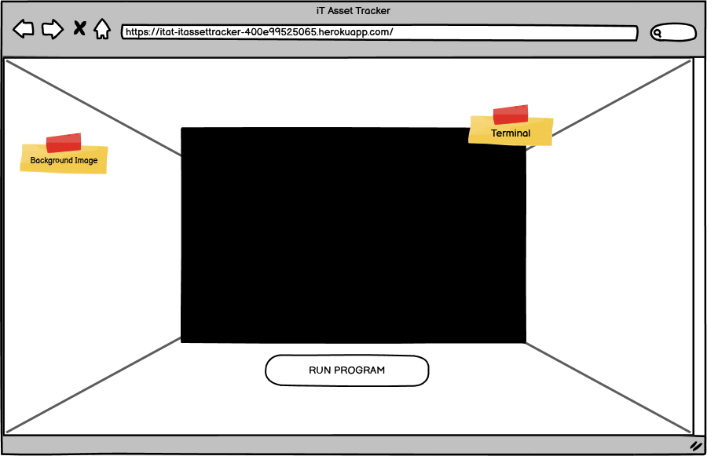
### Colour Scheme
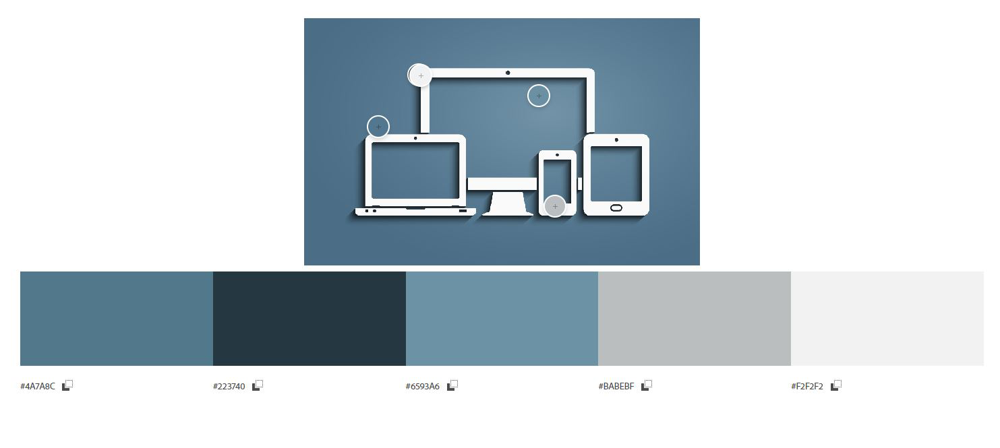
 - ***Primary Color (#223740):*** This is a dark shade of blue used for background elements and other supporting parts of the interface.

 - ***Black (#000000):*** This is pure black, typically used for text and other essential elements that need to stand out. Also, given that the application will be running within a terminal.

 - ***Red (#FF0000):*** This is a standard red color. I used for alerts, error messages, or other critical information.

 - ***White (#ffffff):*** This is pure white, often used for backgrounds or as a text color against darker backgrounds to ensure readability.

### Images
I searched for a background that will suit my application. Given the title it self, I searched for anything that has IT equipment. This image from [Sutherland Weston](https://www.sutherlandweston.com/wp-content/uploads/2017/10/GettyImages-942813588.jpg) is the one I chose. 
### Flowchart

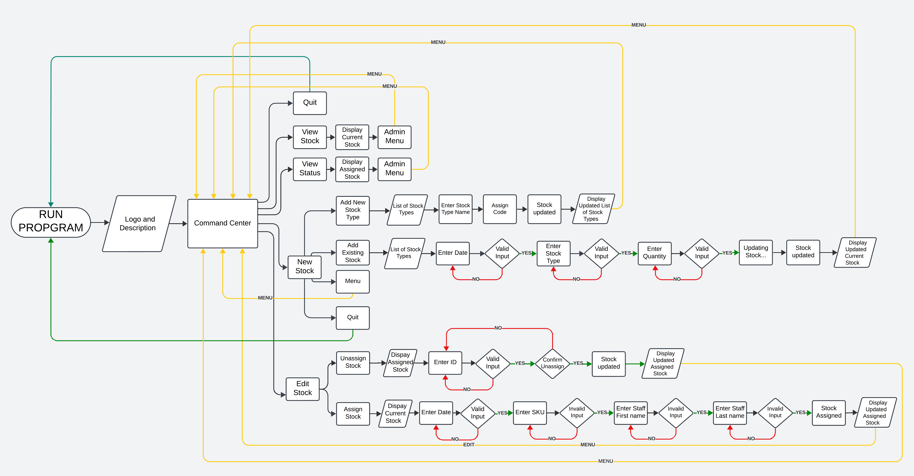

The IT Asset Tracker flowchart outlines the process of managing and tracking IT assets within an organization. It begins with providing user the function available to manage the assets. User can choose from viewing stock, viewing status, new stock, edit stock or quit the application. From any of the function, the flowchart branches into different paths depending on the user's actions or decisions.

One branch of the flowchart involves assigning assets to specific staff members. This process includes validating the availability of assets, confirming the assignment with the staff member, and updating the system accordingly. Another branch covers unassigning assets, which involves identifying the asset to be unassigned, confirming the action with the user, and removing the assignment from the system.

Additionally, the flowchart includes steps for viewing the current status of assets and accessing the further actions such as editing or adding new assets. Throughout the flowchart, error handling and validation steps ensure data integrity and accuracy within the IT asset tracking system.

Overall, the IT Asset Tracker flowchart provides a clear and structured representation of the workflow involved in managing IT assets, guiding users through each step of the process and facilitating efficient asset management within the organization.

## Features
### Welcome Screen
Provides short description of iT Asset tracsker. It is also displaying the Command Center.
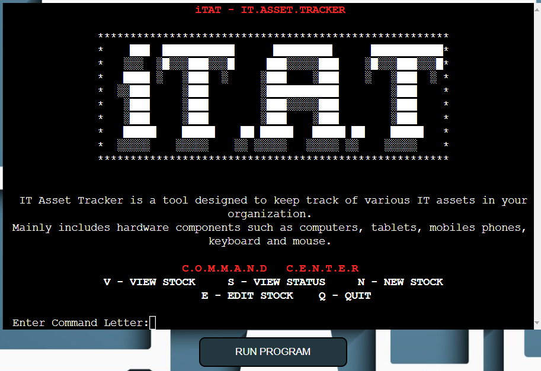
### Command Center

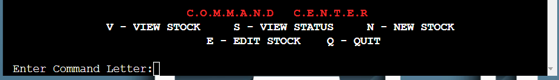
### V - View Stock
View the current inventory listing in a structured table format
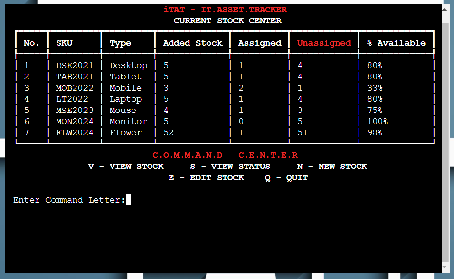
### S - View Status
View the current status of assigned stocks in a tabular format.
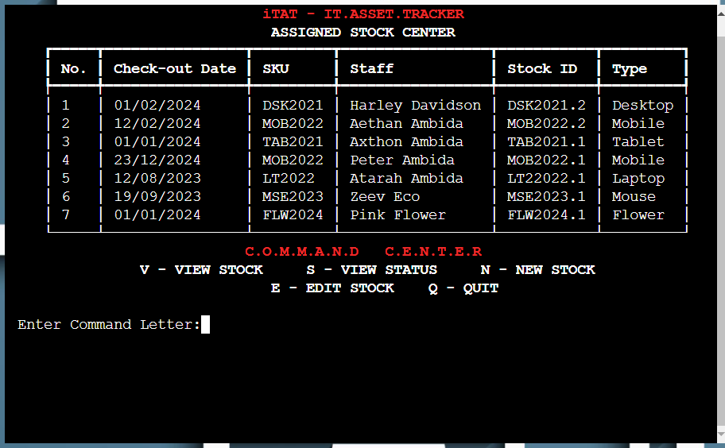
### N - New Stock
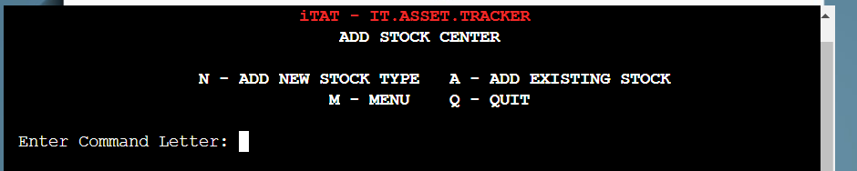
Add a new type of stock to the system.
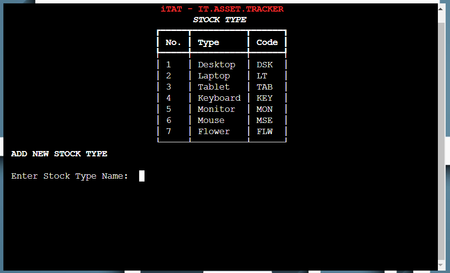
Add existing stock items to the inventory.
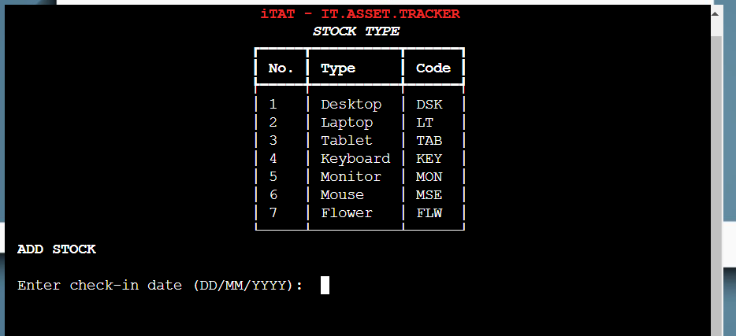
- When stock is added, application generates a unique sku base on type code and year ie Laptop (LT) entered in 01/01/2024, sku will be ***LT2024***  
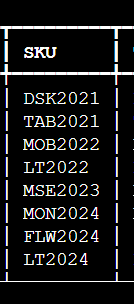
### E - Edit Stock
Assign and unassign assets.
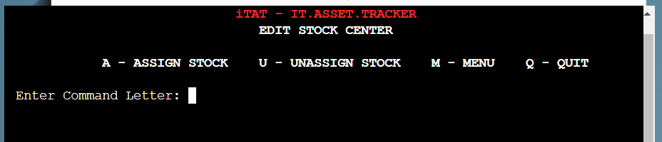
Assign stock items to staff members.
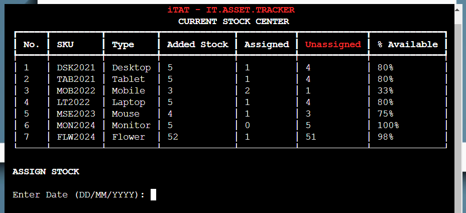
- When a stock is assigned to staff, the application  auto generates a unique stock ID to assign to staff.
    
    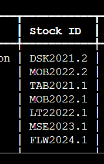

Unassign stock items from staff members.
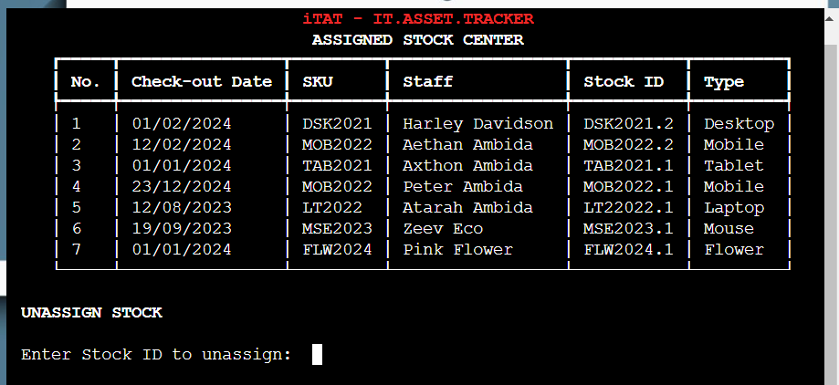
### Q - Quit
This refreshes the 
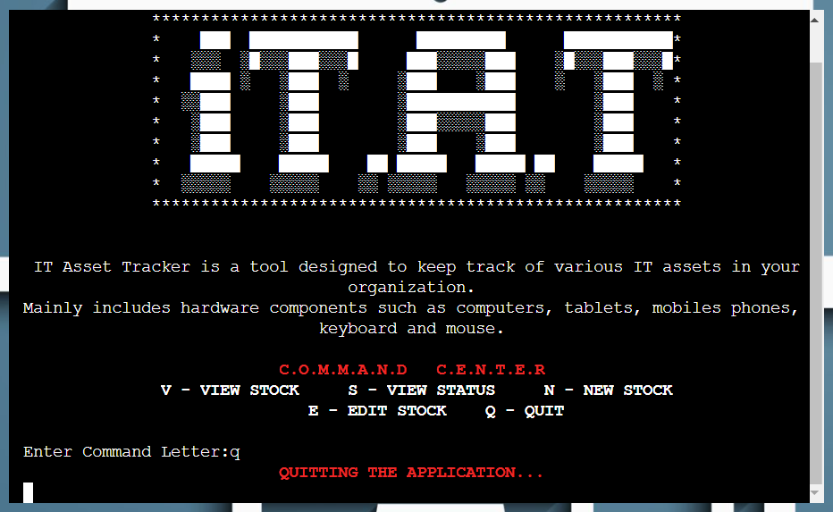
### Storage Data
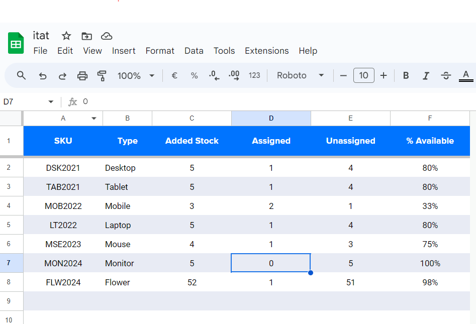
### Date Validations
Date are validated base on the following:
 - Date should not be in the future on all functions.
 - Date should be within the last 5 years when ADDING STOCK, otherwise stock is obsolete.
 - Date should be within the last 12 months when entering assigned stock.
 - Date format should be DD/MM/YYYY
## Future Features
For future enhancements:
 - DISPOSAL: Plan to add disposal of obsolete stocks. Calculation is base on accounting procedure to calculate depreciation.
 - REPORTS: Allow users to generate reports based on various criteria such as stock type, date range, assigned status etc.
 - ALERTS AND NOTIFICATIONS: 
    - Implement a notification system to alert users about low stock levels, expiring stock, or pending assignments.
    - Users can receive alerts via email, SMS, or within the application itself.
 - BARCODE/QR CODE IN TEGRATION:
    - Integrate barcode or QR code scanning functionality to quickly add or assign stock items.
    - This feature can streamline inventory management processes and reduce manual data entry errors.
 - USER ROLE AND PERMISSIONS
    - Define different user roles (e.g., admin, manager, staff) with specific permissions.
    - Admins can have full access to all features, while staff members may only have access to view or assign stock.
 - SEARCH AND FILTER:
    - Allow users to search and filter stock items based on various criteria such as type, SKU, date, etc.
    - Enhance the user experience by making it easier to find specific stock items within large inventories.
 - MOBILE APPLICATION:
    - Develop a mobile application version of the IT asset tracker for on-the-go access.
    - Mobile support enables users to manage stock, view statuses, and make assignments from their smartphones or tablets.
 - AUDIT TRAIL AND HISTORY
    - Maintain a detailed audit trail of all stock-related activities, including additions, assignments, modifications, and deletions.
    - History tracking provides accountability and helps identify discrepancies or issues in the inventory management process.
## Testing
Complete details of testing is found on this [link](testing.md)

## Bugs and Potential Issue
Bugs identified during the process.

1.	When I run my program, it is taking about 8 seconds before it display the start of the program in Heroku. It is the same in Gitpod but the delay is about 15 seconds, I thought it was because Gitpod is dependent on my laptop specs, but seems like it is the same in Heroku. I am unsure what is causing the delay. I have put a timesleep of about 2 seconds on one of the function, I have tried removing it but it did not make any changes.

2.	After deploying iTAT in Heroku, when I first run the application. I was getting an error of:

        Traceback (most recent call last):  
        File "/app/run.py", line 9, in <module>  
        from rich.console import Console  
        ModuleNotFoundError: No module named 'rich'

    I used rich.console to give my texts style. In Gitpod, the app was working fine and not receiving this error. . I searched on some resources online and found this tutorials in [Freecodecamp](https://www.freecodecamp.org/news/module-not-found-error-in-python-solved/). This error indicated that the ‘rich’ module is not installed in my Python environment. So Installed ‘rich’ module by running the following command
    
        pip install rich

    I manually deploy branch to apply changes, after running my app I am still getting the same error. I came across on this question in [Stackoverflow](https://stackoverflow.com/questions/71467608/modulenotfounderror-no-module-named-app-heroku)  whereby the user is having the issue as mine. This is the step I did to fix the error.

    ***Resolution:***

    The following are the steps I took to resolve the issue:        
    
    a.	I install rich by entering this in the command line in Gitpod  

        pip3 install rich
       
    b.	I add the word ‘rich’ in my requirements.txt  
    c.	Commit and push to Github.  
    d.	Run my application in Heroku once it has captured the updates in Github.  
    e.	App run successfully without the error.

3.	On the *add_new_stock* function, after adding a new stock type, the app will append the new stock type on the list of stock type. But if you try to add a stock on the newly added stock type, the app is not recognising the new stock type. You have to re-run the app for it to recognise the new stock eventhough it is listed.

    ***Resolution:***

    After appending the sheet, you will have to refresh the variable valid_stock_types. To refresh the valid_stock_types list, I added this code:

        valid_stock_types.append(new_stock_type)*=

    This code refreshes the valid_stock_types list before it is being displayed after the new stock is added.

4.	On the EDIT STOCK menu, when you ASSIGN STOCK, it updates the Assigned.Stock sheet with the newly assigned stock. As seen below, line no. 6 is a stock I just assigned. 
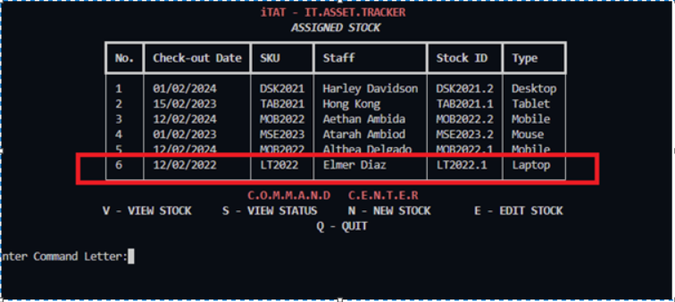

    If I want to immediately unassign this, this is what I am getting:
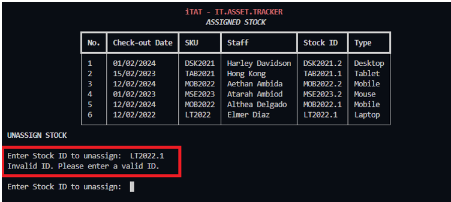
The changes are reflected after I re-run the application.
I am encountering a delay in reflecting the changes made by assign_stock() when I try to immediately unassign a recently assigned stock. Looks like the data not being refreshed after assigning the stock.

    ***Resolution:***

    To address this issue, I have to update the **valid_id** list after appending the newly assigned stock to the sheet. By updating the **valid_id** list after appending the newly assigned stock to the sheet, this ensure that the changes are reflected immediately, allowing user to unassign a recently assigned stock without the need to refresh the terminal. In line 468

        #Updates the valid_id list  
        global valid_id  
        valid_id = viewstatus.col_values(4)
    
    ***Conclusion:***

    Everytime a list updated, you have to refresh the list before calling the function that contains the list. Even though the update is visibile on the output, it doesn't mean it is immediateky available to access. 

## Technologies And Languages
The IT asset tracker system is developed using the following technologies and programming languages:

### Languages Used
 - ***Python:*** The main programming language used for implementing the backend logic and interaction with Google Sheets. Python provides libraries such as gspread for accessing Google Sheets API and rich for enhancing the command-line interface with rich text formatting.

 - ***HTML (Hypertext Markup Language):*** s the standard markup language for creating web pages and web applications. It provides the structure and content of the web pages.
 - ***CSS (Cascading Style Sheets):*** CSS is used for styling the HTML elements, This was used to position, add background and colors to the application web page.
 - ***Rich library:*** Employed for enhancing the command-line interface with formatted text, including colors, styles, and tables, providing a more visually appealing and user-friendly experience.   
 
 Overall, the combination of Python, Google Sheets, Google Sheets API, and the Rich library enables the development of a robust IT asset tracker system with a user-friendly command-line interface for managing inventory effectively.
### Python Modules
- ***Google OAuth2:*** Used for authentication and authorization to access Google Sheets API securely. This allows the application to access and manipulate spreadsheet data on behalf of the user.
- ***sys:*** The sys module provides access to some variables used or maintained by the Python interpreter and to functions that interact with the interpreter. In the context of IT Asset Tracker, it was used for system-level operations such as handling command-line arguments or accessing system-specific information.

- ***time:*** The time module provides various time-related functions. It can be used to handle time-related operations such as calculating time differences, setting delays, or formatting time strings. In IT Asset Tracker, it could be used to timestamp events or manage timeouts.

- ***os:*** The os module provides a way to interact with the operating system. It can be used to perform operating system-related tasks such as navigating the file system, manipulating file paths, or executing shell commands. In IT Asset Tracker, it was used for file management operations or executing system commands related to asset tracking.

- ***datetime:*** The datetime module provides classes for manipulating dates and times. It offers various functionalities for working with dates, times, time zones, and timedelta objects. In IT Asset Tracker, it was used to handle date and time information associated with updating the stock, such as logging check-in/check-out timestamps.

- ***gspread:*** The gspread library is a Python wrapper for the Google Sheets API. It enables developers to interact with Google Sheets programmatically, allowing tasks such as reading/writing data to spreadsheets, formatting cells, or managing worksheets. In IT Asset Tracker, it was used to store and retrieve asset-related data in Google Sheets, providing a centralized and accessible storage solution.

- ***re:*** The re module is Python's built-in regular expression library, which provides support for pattern matching and string manipulation using regular expressions. It allows you to search for specific patterns within strings, extract substrings, replace text, and perform various other text processing tasks based on user-defined patterns. In IT Asset Tracker, the re module was used for parsing and validating input data, extracting relevant information from text fields, or enforcing data format standards.

### User Defined Modules
 - [file_texts](https://github.com/hpcoloma/itat/blob/main/file_texts.py) was used to store long texts and ASCII arts.
### Programs and frameworks
- [***Google Sheets:***](https://docs.google.com/spreadsheets/u/0/) Utilized for storing and managing the inventory data in a spreadsheet format
 - [***Google Sheets API:***](https://developers.google.com/sheets/api/reference/rest) Used to interact with Google Sheets programmatically, allowing the application to read from and write to spreadsheet documents stored in Google Drive.
 - [***Gitpod***](https://www.gitpod.io/d) IDE to develop the app
 - [***GitHub***](https://github.com/) to host source code
 - [***Heroku***](https://heroku.com/) to deploy the live application
 - [***CI Template***](https://github.com/Code-Institute-Org/p3-template) used as the layout to start the project
 - [***CI Pep8 Python Linter***](https://pep8ci.herokuapp.com/) to validate python code
 - [***LucidChart***](https://lucid.app/) to design the flowcharts
 
## Development
This application was develop in Gitod, hosted in GitHub and deployed in Heroku
## Deployment on Heroku
This project is deployed in Heroku
The below steps were followed to deploy the application.
1. Create and account ifd you don't have one.
2. On yuor Dashboard, click Create New App
3. I choose the name "itat-itassettracker" for my application name and choose Europe as region.
4. Click create app.
5. On the app settings tab, I choose the following:  
    a.	***Config Vars*** – I set my key/value pairs for CREDS and PORT.  
    The value for the CREDS key is found in your requirements.txt file. This is automatically generated when you use the command in the terminal ‘pip3 freeze>requirements’. Make sure you run this first before deploying your application.
    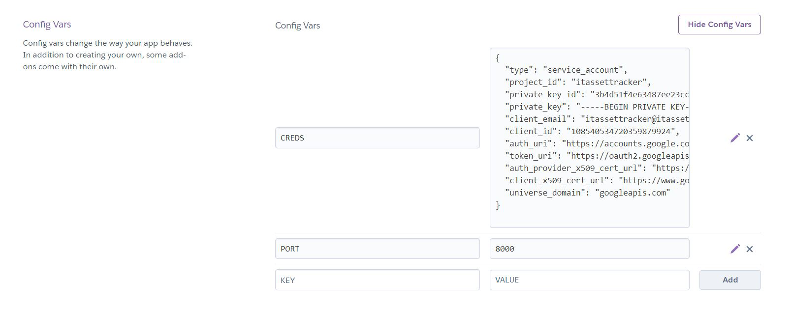
    b.	***Buildpacks*** – added python and nodejs (should be in this order)
    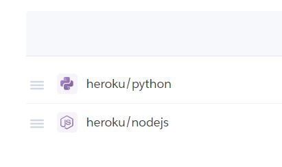  
    c. No settings for SSL  
    d.	***Domains*** – automatically generated.
6. On the Deploy tab  
    a.	***Deployment method*** – Github. You make sure you connect your Github account to Heroku.  
    b.	***App connected to Github*** – I connected my repo “itat” to link up my Heroku app to my Github repository code  
    c.	***Manual Deploy*** – I initially chose this to see the deployment logs as the app is built.  
    d.	***View App*** – I viewed the app.  
    e. ***Automatic Deploys*** - Once I know that my app is running okay, I then enabled automatic deploy so I don’t have to manually deploy branch everytime I push changes to Github. I am 75% done when I deployed this project. Heroku will rebuild my app everytime I push a new change to my code to Github.     
### Forking your repository
To fork a repository on GitHub, follow these steps:

1. Navigate to the Repository: Go to the GitHub repository you want to fork. You can do this by entering the repository URL in your browser or by searching for the repository on GitHub.

2. Find the "Fork" Button: On the repository page, you'll see a button labeled "Fork" in the top right corner of the page, next to the "Star" and "Watch" buttons. Click on the "Fork" button.

3. Choose where to Fork: GitHub will prompt you to choose where you want to fork the repository. You can fork it to your personal GitHub account or to any organizations you're a member of. Select the desired location.

4. Wait for the Fork to Complete: GitHub will create a copy of the repository in your account or organization. Depending on the size of the repository and the current server load, this process may take a few moments.

5. Access Your Forked Repository: Once the forking process is complete, you'll be redirected to your forked copy of the repository. You can now clone the repository to your local machine, make changes, and push them to your fork.

6. Keep Your Fork Synced: If you forked a repository to contribute changes back to the original repository, you may want to keep your fork up-to-date with the original repository. You can do this by configuring an "upstream" remote and pulling changes from it periodically.

That's it! You've successfully forked a repository on GitHub. You can now start working with the code in your fork, making changes, and contributing back to the original repository through pull requests.
### Cloning Repository
To clone a repository from GitHub to your local machine, follow these steps:

1. Find the Repository: Go to the GitHub repository you want to clone. You can do this by entering the repository URL in your browser or by searching for the repository on GitHub.

2. Copy the Repository URL: On the repository page, click on the "Code" button. This will reveal a URL for the repository. Click on the clipboard icon to copy the URL to your clipboard.

3. Open Terminal (or Command Prompt): Open your terminal or command prompt on your local machine. You can usually find it in your applications or by searching for "Terminal" (on macOS and Linux) or "Command Prompt" (on Windows).

4. Navigate to the Directory Where You Want to Clone the Repository: Use the cd command to navigate to the directory where you want to clone the repository. For example, if you want to clone the repository into a folder named "projects" in your home directory, you would use the following command:

        cd ~/projects

5. Clone the Repository: Once you're in the directory where you want to clone the repository, use the git clone command followed by the repository URL you copied earlier. For example, if the repository URL is https://github.com/username/repository.git, you would use the following command:

        git clone https://github.com/username/repository.git

6. Enter Your GitHub Credentials (if prompted): If the repository is private and requires authentication, you may be prompted to enter your GitHub username and password or personal access token.

7. Wait for the Cloning Process to Complete: Git will clone the repository from GitHub to your local machine. Depending on the size of the repository and your internet connection speed, this process may take some time.

8. Access the Cloned Repository: Once the cloning process is complete, you'll have a local copy of the repository on your machine. You can navigate into the repository directory using the cd command and start working with the files.

That's it! You've successfully cloned a repository from GitHub to your local machine. You can now make changes to the files, commit them, and push them back to the repository on GitHub if you have write access.

## Credits

I used the following sources to complete this project.

- [W3School](https://w3schools.com) – code sources for python
- [Stackoverflow](https://stackoverflow.com/) - for codes, tips and answers to some q&a. 
- [JPG 2 PNG](https://jpg2png.com) - to convert jpg to png
- [ASCII Art](https://www.asciiart.eu/text-to-ascii-art) - for ASCII text to logo
- [Jetbrains](https://www.jetbrains.com/help/hub/markdown-syntax.html) - reference for markdown sheet
- [Sutherland Weston](https://www.sutherlandweston.com/wp-content/uploads/2017/10/GettyImages-942813588.jpg) - for my background image
- [Sheetgo](https://www.sheetgo.com/) - used to create my google sheet
- [Eightshades Contrast Grid](https://contrast-grid.eightshapes.com/?version=1.1.0&background-colors=&foreground-colors=%234a7abc%0D%0A%23223740%0D%0A%236593A6%0D%0ABABEBF%0D%0A%23F2f2f2%0D%0Afffff%0D%0A&es-color-form__tile-size=compact&es-color-form__show-contrast=aaa&es-color-form__show-contrast=aa&es-color-form__show-contrast=aa18&es-color-form__show-contrast=dnp) - checked the colour combination contrast
- [Adobe Color](https://color.adobe.com) - created my palette by uploading the background image here
- [Balsamiq](https://balsamiq.com/) - for wireframes

## Acknowledgements
This project will not be live today without the help and support of the following people:

1. Arnold Ambida - my husband, who looks after my 3 children while I do this course.
2. Matt Bodden - my mentor who have made a significant impact on completing this projecs with all the tips and the encouragements.

