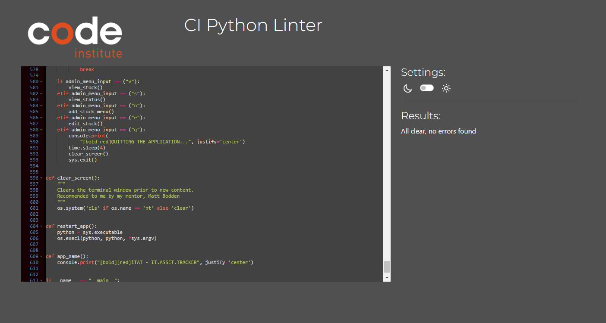

# iT ASSET MANAGEMENT

# Table of Contents
- [Project Introduction](#project-introduction)
    - [iT Asset Tracker](#it-asset-tracker)
    - [Link to live project](#link-to-live-project)
    - [Objective](#objective)
-   [User Experience](#user-experience)
    - [User Stories](#user-stories)
    - [Strategy Plan](#strategy-plan)
    - [Scope](#scope)
-   [Design](#design)
    - [Wireframe](#wireframe)
    - [Colour Scheme](#colour-scheme)
    - [Flowchart](#flowchart)
-   [Features](#features)
    - [Welcome Screen](#Welcome-Screen)
    - [Command Center](#command-center)
    - [C - Add stock](#c---add-stock)
    - [V - View Stock](#v---view-stock)
    - [S - Search and edit](#s---search-and-edit)
    - [E - Edit stock location](#e---edit-stock-location)
    - [D - Delete](#d---delete)
    - [I - Instructions](#i---instructions)
    - [Q - Quit](#q---quit)
-   [Future Features](#future-features)
-   [Testing](#testing)
-   [Bugs](#Bugs)
-   [Technologies And Languages](#technologies-and-languages)
    - [Languages Used](#languages-used)
    - [Python Modules](#python-modules)
    - [User Defined Modules](#user-defined-modules)
    - [Technologies and programs](#technologies-and-programs)
-   [Deployment](#deployment)
    - [Before Deployment](#before-deployment)
    - [Deployment on Heroku](#deployment-on-heroku)
    - [Creating A Fork](#creating-a-fork)
    - [Cloning Repository](#cloning-repository)
-   [Credits](#credits)
    - [Media](#media)
    - [Code](#code)
    - [Acknowledgements](#acknowledgements)
    - [Comments](#comments)

## Project Introduction

### IT Asset Tracker

This program is designed to track IT assets, allowing IT administrators to add, view, assign and unassign stock to staff.

### [Link to live project](https://itat-itassettracker-400e99525065.herokuapp.com/)

### Objective
To create an application that will assist IT Administrator in managing their IT assets. This application was designed using Python with Google Sheet API integration. The objective is to provide various functionalities such as adding new stock types, viewing current stock status, viewing assigned stock status, editing stock (assigning or unassigning), and quitting the application.

## User Experience
To efficiently manage and track IT assets within an organization. This includes the following tasks:

 - Viewing Stock Status: Users should be able to view status of each item including details such as who it is assigned to.

 - Viewing Current Stock: Users should be able to view the current inventory of IT assets, including details such as the SKU, type, quantity, and availability.

  - Adding New Stock: Users should be able to easily add new IT assets to the inventory, specifying details such as the check-in date, type of asset, and quantity.

 - Assigning Stock: Users should be able to assign IT assets to staff members, recording details such as the date of assignment, the staff member's name, and the stock ID.

 - Unassigning Stock: Users should be able to unassign IT assets from staff members when necessary, updating the status of the assets in the inventory.

 - Viewing Status: Users should be able to view the status of assigned IT assets, including details such as the check-out date, staff member assigned, and current status.

 - Managing Stock Types: Users may need to manage the list of available stock types, including adding new types, updating existing types, or removing obsolete types.

### User Stories
As an IT administrator, I would like to do the following: 
 - I want to add new IT assets to the inventory, specifying details such as the check-in date, type of asset, and quantity, so that the inventory is up-to-date.

 - As an IT administrator, I want to assign IT assets to staff members, recording details such as the date of assignment, the staff member's name, and the stock ID, so that assets are properly allocated and tracked.

 - I want to unassign IT assets from staff members when necessary, updating the status of the assets in the inventory, so that assets can be reallocated or returned as needed.

 - I want to edit or modify existing stock entries, such as updating quantities or correcting details, to keep the inventory accurate and up-to-date.

 - I want to manage the list of available stock types, including adding new types, updating existing types, or removing obsolete types, to ensure that the inventory reflects the current range of assets.

 - I want reporting capabilities to generate reports on stock levels, stock assignments, usage trends, and other relevant metrics, to provide insights into asset management and usage within the organization.

### Strategy Plan
Creating this application involves several steps. I want to ensure that it will meet the needs and provides a solution for managing IT assets effectively. Here's my plan on the creation of this application.
1. DESIGN: I first design my application. I used [Lucidchart](https://lucid.app/) to create my flowchart. this helped me visualized the flow of the functionality of my application that I want to achieve.
2. DATA SHEET: I created a [Google Sheet](https://docs.google.com/) where I want to store inputs on my application. I make sure that this is properly integrated to my Github account.
3. CODING: I used [Gitpod](https://gitpod.io) to create this application. I also referenced some of my work from the Love Sandwiches video tutorial. Basic steps such as setting up my [Heroku](https://heroku.com) and Google Sheets can be found on the Love Sandwiches video tutorial.
4. STYLE: When I was 75% complete, I added the style to make this project look appealing to end users.
5. DEPLOYMENT: I set up my Heroku account half way through my project and the deployment instruction can also be found in the Love Sandwiches video tutorial.
6. TEST AND DEBUG: While creating this project, I encountered some bugs which is detailed on the Deployment section of this ReadMe.
7. DOCUMENTATION: As I build the application, I am also creating the ReadMe. 

### Scope
The scope of the IT asset tracking application project encompasses the development of a software solution that enables organizations to efficiently manage their IT assets. Here's a breakdown of the scope:

   - Asset Management: Allow users to add, view, edit, and delete IT assets such as computers, laptops, servers, peripherals, software licenses, and other equipment.
   - Inventory Tracking: Provide real-time visibility into the current inventory of IT assets, including details such as asset type, quantity, location, status, and ownership.
   - Assignment and Allocation: Enable users to assign assets to staff members or departments, track asset allocations, and monitor usage patterns.
   - Check-in and Check-out: Support check-in and check-out processes for assets, allowing users to track the movement of assets within the organization.
   - Reporting and Analytics: Generate reports and analytics dashboards to analyze asset utilization, identify trends, and make data-driven decisions.

## Design
### Wireframe
I used [Balsamiq](https://balsamiq.com) to generate digital sketches of how it will look like. 

### Colour Scheme

 - Primary Color (#223740): This is a dark shade of blue used for background elements and other supporting parts of the interface.

 - Black (#000000): This is pure black, typically used for text and other essential elements that need to stand out. Also, given that the application will be running within a terminal.

 - Red: This is a standard red color. I used for alerts, error messages, or other critical information.

 - White (#ffffff): This is pure white, often used for backgrounds or as a text color against darker backgrounds to ensure readability.

### Images
I searched for a background that will suit my application. Given the title it self, I searched for anything that has IT equipment. This image from [Sutherland Weston](https://www.sutherlandweston.com/wp-content/uploads/2017/10/GettyImages-942813588.jpg) is the one I chose. 
### Flowchart

The IT Asset Tracker flowchart outlines the process of managing and tracking IT assets within an organization. It begins with providing user the function available to manage the assets. User can choose from viewing stock, viewing status, new stock, edit stock or quit the application. From any of the function, the flowchart branches into different paths depending on the user's actions or decisions.

One branch of the flowchart involves assigning assets to specific staff members. This process includes validating the availability of assets, confirming the assignment with the staff member, and updating the system accordingly. Another branch covers unassigning assets, which involves identifying the asset to be unassigned, confirming the action with the user, and removing the assignment from the system.

Additionally, the flowchart includes steps for viewing the current status of assets and accessing the further actions such as editing or adding new assets. Throughout the flowchart, error handling and validation steps ensure data integrity and accuracy within the IT asset tracking system.

Overall, the IT Asset Tracker flowchart provides a clear and structured representation of the workflow involved in managing IT assets, guiding users through each step of the process and facilitating efficient asset management within the organization.

## Features
### Welcome Screen
Provides short description of iT Asset tracsker. It is also displaying the Command Center.

### Command Center

### V - View Stock
View the current inventory listing in a structured table format

### S - View Status
View the current status of assigned stocks in a tabular format.

### N - New Stock
Add a new type of stock to the system.
Add existing stock items to the inventory.

### E - Edit Stock
Assign and unassign assets.

Assign stock items to staff members.

- When a stock is assigned to staff, the application  auto generates a unique stock ID to assign to staff.
    
    

Unassign stock items from staff members.

### Q - Quit
This refreshes the 

### Storage Data

## Future Features
For future enhancements:
 - DISPOSAL: Plan to add disposal of obsolete stocks. Calculation is base on accounting procedure to calculate depreciation.
 - REPORTS: Alow users to generate reports based on various criteris such as stock type, date range, assigned status etc.
 - ALERTS AND NOTIFICATIONS: 
    - Implement a notification system to alert users about low stock levels, expiring stock, or pending assignments.
    - Users can receive alerts via email, SMS, or within the application itself.
 - BARCODE/QR CODE IN TEGRATION:
    - Integrate barcode or QR code scanning functionality to quickly add or assign stock items.
    - This feature can streamline inventory management processes and reduce manual data entry errors.
 - USER ROLE AND PERMISSIONS
    - Define different user roles (e.g., admin, manager, staff) with specific permissions.
    - Admins can have full access to all features, while staff members may only have access to view or assign stock.
 - SEARCH AND FILTER:
    - Allow users to search and filter stock items based on various criteria such as type, SKU, date, etc.
    - Enhance the user experience by making it easier to find specific stock items within large inventories.
 - MOBILE APPLICATION:
    - Develop a mobile application version of the IT asset tracker for on-the-go access.
    - Mobile support enables users to manage stock, view statuses, and make assignments from their smartphones or tablets.
AUDIT TRAIL AND HISTORY
    - Maintain a detailed audit trail of all stock-related activities, including additions, assignments, modifications, and deletions.
    - History tracking provides accountability and helps identify discrepancies or issues in the inventory management process.
## Testing
Complete details of testing is found on this [link](testing.md)

## Bugs
Bugs identified during the process.

1.	When I run my program, it is taking about 8 seconds before it display the start of the program in Heroku. It is the same in Gitpod but the delay is about 15 seconds, I thought it was because Gitpod is dependent on my laptop specs, but seems like it is the same in Heroku. I am unsure what is causing the delay. I have put a timesleep of about 2 seconds on one of the function, I have tried removing it but it did not make any changes.

2.	After deploying iTAT in Heroku, when I first run the application. I was getting an error of:

    *Traceback (most recent call last):
    File "/app/run.py", line 9, in <module> 
    from rich.console import Console 
    ModuleNotFoundError: No module named 'rich'*

    I used rich.console to give my texts style. In Gitpod, the app was working fine and not receiving this error. . I searched on some resources online and found this tutorials in Freecodecamp (source: https://www.freecodecamp.org/news/module-not-found-error-in-python-solved/). This error indicated that the ‘rich’ module is not installed in my Python environment. So Installed ‘rich’ module by running the following command
    *pip install rich*
I
I manually deploy branch to apply changes, after running my app I am still getting the same error. I came across on this question in Stackoverflow (https://stackoverflow.com/questions/71467608/modulenotfounderror-no-module-named-app-heroku)  whereby the user is having the issue as mine. 

*Resolution:*

The following are the steps I took to resolve the issue:
a.	I install rich by entering this in the command line in Gitpod
‘pip3 install rich’
b.	I add the word ‘rich’ in my requirements.txt
c.	Commit and push to Github. 
d.	Run my application in Heroku once it has captured the updates in Github.
e.	App run successfully without the error.

3.	On the add_new_stock function, after adding a new stock type, the app will append the new stock type on the list of stock type. But if you try to add a stock on the newly added stock type, the app is not recognising the new stock type. You have to re-run the app for it to recognise the new stock eventhough it is listed.
Resolution:
After appending the sheet, you will have to refresh the variable valid_stock_types. To refresh the valid_stock_types list, I added this code:
valid_stock_types.append(new_stock_type)
4.	On the EDIT STOCK menu, when you ASSIGN STOCK, it updates the Assigned 
Stock sheet with the newly assigned stock. As seen below, line no. 6 is a stock I just assigned.

## Technologies And Languages
### Languages Used
### Python Modules
### User Defined Modules
### Technologies and programs
## Deployment
### Before Deployment
### Deployment on Heroku    
### Creating A Fork
### Cloning Repository
## Credits
### Media
### Code
### Acknowledgements
### Comments](#comments)

