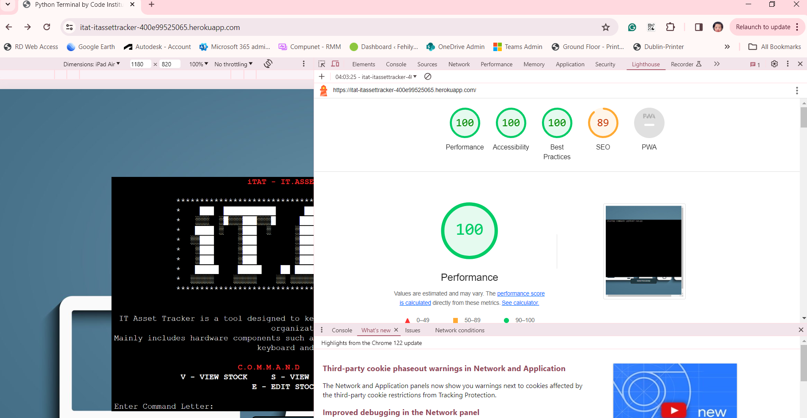
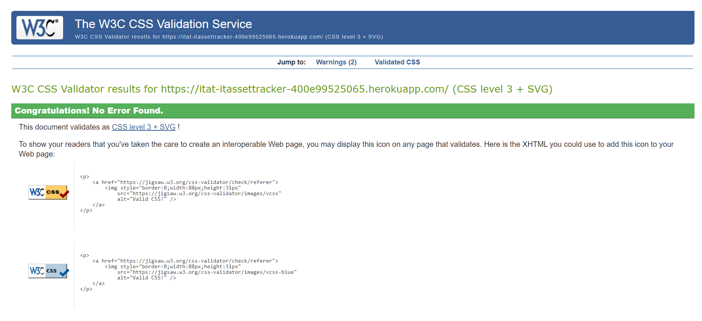

# iT ASSET TRACKER (iTAT)

### [Link to live project](https://itat-itassettracker-400e99525065.herokuapp.com/)

## User Story Testing
- As an IT Administrator, I want to be able to view the current stock inventory so that I can assess the availability of different types of stock.
#### Acceptance Criteria:

1. When I log in to the IT asset tracker system, I should see an option to view the stock inventory.
2. Upon selecting the "View Stock" option, I should be presented with a list of all stock items currently available.
3. The list should display relevant details for each stock item, such as SKU, type, quantity, and assignment status.
4. I should be able to easily navigate through the list and scroll if necessary to view all the stock items.
5. I should have the option to return to the main menu or perform other actions after viewing the stock inventory.

#### Testing Steps:

1. Log in to the IT asset tracker system as an IT Administrator.
2. Navigate to the "View Stock" option from the main menu.
3. Verify that a list of stock items is displayed, showing relevant details for each item.
4. Return to the main menu and verify that the option to view stock inventory is accessible again.

-  As an IT Administrator, I want to be able to view the status of assigned stock items so that I can track their check-out details.

#### Acceptance Criteria:

1. 	Upon logging in to the IT asset tracker system, I should see an option to view the status of assigned stock items.
2.	When I select the "View Status" option, I should be presented with a list of all assigned stock items along with their check-out details.
3.	The list should include information such as the check-out date, SKU, staff member assigned, and stock ID.
4.	I should be able to easily navigate through the list and scroll if necessary to view all the assigned stock items.
5.	After viewing the status of assigned stock items, I should have the option to return to the main menu or perform other actions.

#### Testing Steps:

1. Log in to the IT asset tracker system.
2.	Navigate to the "View Status" option from the main menu.
3.	Verify that a list of assigned stock items is displayed, showing relevant details for each item.
4.	Scroll through the list to ensure that all assigned stock items are visible.
5.	Return to the main menu and verify that the option to view assigned stock status is accessible again.

As an IT Administrator,  I want to be able to add new stock items to the inventory so that I can keep track of all available items.

#### Acceptance Criteria:

1. 	When I log in to the IT asset tracker system, I should see an option to add new stock items.
2. Upon selecting the "New Stock" option, I should be presented with a submenu where I can choose to add a new type of stock or add an existing stock.
3. If I choose to add a new type of stock, I should be prompted to enter the name and code for the new stock type.
4. If I choose to add an existing stock, I should be able to select from a list of available stock types.
5. After providing the necessary information, the new stock item should be added to the inventory.
6. Once the stock item is added successfully, I should receive a confirmation message.

#### Testing Steps:

1. Log in to the IT asset tracker system.
2. Navigate to the "New Stock" option from the main menu.
3. Choose to add a new type of stock and enter the name and code for the new stock type.
4. Confirm that the new stock item is added to the inventory.
5. Return to the main menu and verify that the newly added stock item is visible in the inventory.
6. Choose to add an existing stock and select a stock type from the list.
7. Confirm that the selected stock item is added to the inventory.
8. Return to the main menu and verify that both newly added stock items are displayed correctly.

-  I want to be able to view the current stock and status of all assigned stocks so that I can monitor inventory levels and track assigned assets.

#### Acceptance Criteria:

1. When I log in to the IT asset tracker system, I should see options to view the current stock and status of assigned stocks.
2. Upon selecting the "View Stock" option, I should be presented with a table displaying the current inventory listing, including SKU, type, quantity, and availability status.
3. Upon selecting the "View Status" option, I should be presented with a table displaying the status of all assigned stocks, including check-out date, SKU, staff member, and stock ID.
4. Both tables should be formatted clearly and sorted appropriately for easy readability.

#### Testing Steps:

1. Log in to the IT asset tracker system as a warehouse manager.
2. Navigate to the "View Stock" option from the main menu.
3. Verify that the current inventory listing is displayed correctly, including all relevant information.
4. Check for any low availability items and verify that the warning message is displayed if applicable.
5. Return to the main menu and navigate to the "View Status" option.
6. Verify that the status of all assigned stocks is displayed correctly, including check-out date, staff member, and stock ID.
7. Ensure that both tables are formatted properly and sorted for easy readability.

- I want to be able to add new stock items to the inventory, either by adding a new type of stock or by adding existing stock with a specified quantity and date.

#### Acceptance Criteria:

1. When I log in to the IT asset tracker system, I should have the option to add new stock items from the main menu.
2. Upon selecting the "New Stock" option, I should be presented with sub-options to either add a new type of stock or add existing stock.
3. If I choose to add a new type of stock, I should be prompted to enter the name and code for the new stock type, and upon submission, the new stock type should be added to the inventory.
4. If I choose to add existing stock, I should be prompted to enter the check-in date, stock type, and quantity for the stock item, and upon submission, the new stock item should be added to the inventory with a generated SKU.
5. After successfully adding new stock items, I should receive a confirmation message indicating the successful addition of the item.

#### Testing Steps:

1. Log in to the IT asset tracker system
2. Navigate to the "New Stock" option from the main menu.
3. Choose the option to add a new type of stock.
4. Enter a name and code for the new stock type and submit the form.
5. Verify that the new stock type is added to the inventory.
6. Return to the main menu and navigate to the "New Stock" option again.
7. Choose the option to add existing stock.
8. Enter the check-in date, stock type, and quantity for the new stock item and submit the form.
9. Verify that the new stock item is added to the inventory with a generated SKU.
10. Ensure that a confirmation message is displayed indicating the successful addition of the item.

## Automated Testing
### Pep8 CI Python Linter
 - ### **Result - All clear, no errors found**

### Lighthouse

- ### **Result - Pass**

)

### W3C CSS Validator
There were some additional css code addedd to the layout.html that includes background image and positioning of the terminal and button on the browser.
- ### **Result - No Error Found**
